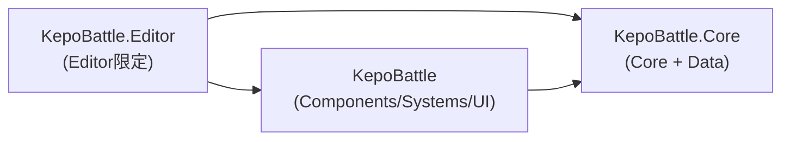

# KepoBattle ディレクトリ構造提案（コア/コンポーネント分離）

- 作成日: 2026-07-21
- 対象: `Assets/Scripts` 以下（サンプルアセットと自動生成の `InputSystem_Actions.cs` は対象外）
- 関連: [`ARCHITECTURE_REVIEW.md`](./ARCHITECTURE_REVIEW.md)（本提案は同レビューの §4.3 / §5-1 / §6 と接続している）
- 方針: **フル層構造**（層を第一軸、機能を第二軸）

---

## 1. 前提：MonoBehaviour は実は3層に分かれる

「MonoBehaviour か否か」ではなく、**役割**で3つに割れる。現状の密結合の一因は、この3層が同じ場所に混在していること。

| 層 | 性質 | 代表 |
|---|---|---|
| ① 純粋ロジック / データ | MonoBehaviour 非依存。計算・契約・データ。数学型のみ許可 | `CombatData`, `AttackType`, `IHealthManager`, `IAttackInfoGetter`, `MissingChannelException` |
| ② エンティティ部品 | GameObject に貼る。1エンティティに複数、Prefab の一部 | Character/Prop 配下の大半、Notifier 3種、`PhysicsMover` 系、`DamageProcessor` 系 |
| ③ シーン常駐システム | MonoBehaviour だが「部品」ではない。シーンに1つ、所有エンティティが無い | `GameUtility`, `UIController` |

`UIController` / `GameUtility` は「部品ではないマネージャ」であり、`PlayerController`（プレイヤー GameObject に貼る部品）とは別カテゴリ。本提案では **③ を専用の層（`Systems/` / `UI/`）に隔離**して、フォルダを見ただけで区別できるようにする。

---

## 2. 推奨ディレクトリ構造

```
Assets/Scripts/
├── Core/                    ← ① 純粋C#。MonoBehaviour禁止。数学型(Vector2/Mathf)のみ許可
│   ├── Combat/
│   │   ├── AttackType.cs            （AttackExecutorのnamespace外enumをここへ）
│   │   ├── DamageCalculator.cs      ★将来: DamageProcessorから計算部を抽出
│   │   └── MovementSolver.cs        ★将来: PhysicsMoverから速度積分を抽出(Review §4.4)
│   ├── Contracts/                    ← インターフェース＝層をまたぐ契約
│   │   ├── IHealthManager.cs
│   │   └── IAttackInfoGetter.cs
│   └── Exceptions/
│       └── MissingChannelException.cs
│
├── Data/                    ← ① Serializableなデータ / ScriptableObject定義
│   ├── CombatData.cs                （AttackCollisionSetting系 / AttackInfo）
│   └── AttackDefinition.cs          ★将来: 攻撃1種をSO化(Review §4.1-2)
│
├── Components/              ← ② エンティティ部品(MonoBehaviour)。Coreの薄いアダプタ
│   ├── Movement/
│   │   ├── PhysicsMover.cs
│   │   ├── CharacterPhysicsMover.cs
│   │   └── PropPhysicsMover.cs
│   ├── Combat/
│   │   ├── AttackExecutor.cs
│   │   ├── DamageProcessor.cs
│   │   ├── CharacterDamageProcessor.cs
│   │   ├── PropDamageProcessor.cs
│   │   ├── CharacterHealthManager.cs
│   │   ├── PropHealthManager.cs
│   │   ├── CharacterAttackCollisionController.cs
│   │   ├── PropAttackCollisionController.cs
│   │   └── TeamSetting.cs
│   ├── Detection/                    ← 衝突検出→イベント変換のNotifier群
│   │   ├── GeometryHitNotifier.cs
│   │   ├── DamageHitNotifier.cs
│   │   └── AttackHitNotifier.cs
│   ├── Animation/
│   │   ├── AnimatorTrigger.cs
│   │   └── StateProgressionNotifier.cs   （StateMachineBehaviour。※3.1の注記）
│   ├── Camera/
│   │   └── CameraController.cs
│   └── Controllers/                  ← 「頭脳」＝入力/AIを部品への指令に変換する部品
│       ├── PlayerController.cs
│       ├── EnemyController.cs
│       └── AttackController.cs        （Prop用）
│
├── Systems/                ← ③ シーン常駐マネージャ(MonoBehaviourだが部品でない)
│   ├── GameManager.cs               （旧GameUtility: 進行・リスポーン）
│   └── DebugSpawner.cs              （旧GameUtilityのデバッグスポーン部を分離, Review §4.6）
│
├── UI/                     ← ③ UI配線(MonoBehaviour)
│   └── UIController.cs
│
└── Editor/                 ← エディタ拡張(別asmdef必須)
    └── AttackCollisionSettingDrawer.cs
```

### 2.1 この構造が満たす目的

- **コア処理 vs 部品の分離**: `Core/`（純粋ロジック）と `Components/`（MonoBehaviour アダプタ）がトップで分かれる。現状は純粋ロジックがほぼ未抽出だが、`Core/Combat/` が **「これから抜き出す計算の置き場所」** として先に存在する。例: `PhysicsMover`（Rigidbody/Collider を触る薄い MB）→ `MovementSolver`（速度・重力・摩擦の積分だけの純粋 C#）、`DamageProcessor` → `DamageCalculator`。
- **非コンポーネント MonoBehaviour の隔離**: `GameUtility` / `UIController` を `Systems/` / `UI/` に出し、エンティティ部品（`Components/`）と混ざらないようにする。「シーンに1個だけ置くマネージャ」であることがフォルダで判る。
- **base + 派生の同居**: `PhysicsMover` + `Character/PropPhysicsMover`、`DamageProcessor` + `Character/PropDamageProcessor` が同フォルダに並び、継承ファミリーが一望できる（現状は Battle 直下と Character/Prop に分散）。

---

## 3. 全ファイル振り分け表

| # | 現在のパス | 移動先 | namespace | 備考 |
|---|---|---|---|---|
| 1 | `Battle/CombatData.cs` | `Data/CombatData.cs` | `KepoBattle.Data` | struct/enum群 |
| 2 | `Battle/Character/AttackExecutor.cs`（内 `AttackType` enum） | enum のみ `Core/Combat/AttackType.cs` へ分離 | `KepoBattle.Core.Combat` | namespace外enumの解消(Review §6) |
| 3 | `Battle/Interfaces/IHealthManager.cs` | `Core/Contracts/IHealthManager.cs` | `KepoBattle.Core.Contracts` | 契約 |
| 4 | `Battle/Interfaces/IAttackInfoGetter.cs` | `Core/Contracts/IAttackInfoGetter.cs` | `KepoBattle.Core.Contracts` | 契約 |
| 5 | `Exceptions/MissingChannelException.cs` | `Core/Exceptions/MissingChannelException.cs` | `KepoBattle.Core.Exceptions` | |
| 6 | `Battle/PhysicsMover.cs` | `Components/Movement/PhysicsMover.cs` | `KepoBattle.Components.Movement` | base |
| 7 | `Battle/Character/CharacterPhysicsMover.cs` | `Components/Movement/CharacterPhysicsMover.cs` | `KepoBattle.Components.Movement` | 派生 |
| 8 | `Battle/Prop/PropPhysicsMover.cs` | `Components/Movement/PropPhysicsMover.cs` | `KepoBattle.Components.Movement` | 派生 |
| 9 | `Battle/Character/AttackExecutor.cs` | `Components/Combat/AttackExecutor.cs` | `KepoBattle.Components.Combat` | classは移動、enumは#2で分離 |
| 10 | `Battle/DamageProcessor.cs` | `Components/Combat/DamageProcessor.cs` | `KepoBattle.Components.Combat` | base |
| 11 | `Battle/Character/CharacterDamageProcessor.cs` | `Components/Combat/CharacterDamageProcessor.cs` | `KepoBattle.Components.Combat` | 派生 |
| 12 | `Battle/Prop/PropDamageProcessor.cs` | `Components/Combat/PropDamageProcessor.cs` | `KepoBattle.Components.Combat` | 派生 |
| 13 | `Battle/Character/CharacterHealthManager.cs` | `Components/Combat/CharacterHealthManager.cs` | `KepoBattle.Components.Combat` | |
| 14 | `Battle/Prop/PropHealthManager.cs` | `Components/Combat/PropHealthManager.cs` | `KepoBattle.Components.Combat` | |
| 15 | `Battle/Character/CharacterAttackCollisionController.cs` | `Components/Combat/CharacterAttackCollisionController.cs` | `KepoBattle.Components.Combat` | |
| 16 | `Battle/Prop/PropAttackCollisionController.cs` | `Components/Combat/PropAttackCollisionController.cs` | `KepoBattle.Components.Combat` | |
| 17 | `Battle/TeamSetting.cs` | `Components/Combat/TeamSetting.cs` | `KepoBattle.Components.Combat` | チーム/FF判定のマーカー |
| 18 | `Battle/GeometryHitNotifier.cs` | `Components/Detection/GeometryHitNotifier.cs` | `KepoBattle.Components.Detection` | |
| 19 | `Battle/DamageHitNotifier.cs` | `Components/Detection/DamageHitNotifier.cs` | `KepoBattle.Components.Detection` | |
| 20 | `Battle/AttackHitNotifier.cs` | `Components/Detection/AttackHitNotifier.cs` | `KepoBattle.Components.Detection` | |
| 21 | `Battle/Character/AnimatorTrigger.cs` | `Components/Animation/AnimatorTrigger.cs` | `KepoBattle.Components.Animation` | |
| 22 | `Animation/StateProgressionNotifier.cs` | `Components/Animation/StateProgressionNotifier.cs` | `KepoBattle.Components.Animation` | StateMachineBehaviour（3.1） |
| 23 | `Battle/Character/Player/CameraController.cs` | `Components/Camera/CameraController.cs` | `KepoBattle.Components.Camera` | |
| 24 | `Battle/Character/Player/PlayerController.cs` | `Components/Controllers/PlayerController.cs` | `KepoBattle.Components.Controllers` | 頭脳 |
| 25 | `Battle/Character/Enemy/EnemyController.cs` | `Components/Controllers/EnemyController.cs` | `KepoBattle.Components.Controllers` | 頭脳 |
| 26 | `Battle/Prop/AttackController.cs` | `Components/Controllers/AttackController.cs` | `KepoBattle.Components.Controllers` | Propの頭脳 |
| 27 | `GameUtility.cs` | `Systems/GameManager.cs` ＋ `Systems/DebugSpawner.cs` | `KepoBattle.Systems` | 2責務を分割(Review §4.6) |
| 28 | `Battle/UIController.cs` | `UI/UIController.cs` | `KepoBattle.UI` | |
| 29 | `Editor/AttackCollisionSettingDrawer.cs` | `Editor/AttackCollisionSettingDrawer.cs` | `KepoBattle.Editor` | 位置は不変、asmdef配下へ |

### 3.1 StateProgressionNotifier の扱い

`StateProgressionNotifier` は GameObject に貼る部品ではなく、Animator ステートに貼る `StateMachineBehaviour`。厳密には「② 部品」ではないが、**アニメーション用の Unity グルー**として `Components/Animation/` に同居させるのが実用的。純粋さを優先するなら `Components/AnimatorBehaviours/` を切ってもよい。

---

## 4. 境界を「強制」する：asmdef

フォルダ分割だけでは、`Core` のクラスがうっかり `PlayerController` を参照しても止められない。**asmdef で参照方向を固定**して初めて分離が本物になる。



推奨は3つ（`Data` は規模的に `Core` へ同梱）:

| asmdef | 含む | 参照 | プラットフォーム |
|---|---|---|---|
| `KepoBattle.Core.asmdef` | `Core/`, `Data/` | なし | 全て |
| `KepoBattle.asmdef` | `Components/`, `Systems/`, `UI/` | `KepoBattle.Core` | 全て |
| `KepoBattle.Editor.asmdef` | `Editor/` | `KepoBattle`, `KepoBattle.Core` | Editor のみ |

### 4.1 asmdef 導入の実利（3点）

1. **`Core` がゲームロジック層を参照できなくなる** → 「計算クラスに Controller 参照が紛れ込む」事故を型レベルで封じ、依存を一方向に固定する。
2. **`Editor.asmdef` がエディタ限定ビルドになる** → Review §5-1 の `using UnityEditor;` / `using NUnit...;` によるビルド破壊が**構造的に起こせなくなる**（ランタイム側からエディタ専用 API が不可視になる）。
3. **差分コンパイルが効く** → 1ファイル修正時に全体を再コンパイルしなくなる。

### 4.2 注意

- `Core` は `Vector2` / `Mathf` を使うため `UnityEngine` 参照は残す（`noEngineReferences` は立てない）。**「MonoBehaviour を Core に書かない」は規約＋レビューで担保する部分**であり、asmdef が機械的に守るのは「他アセンブリへの参照方向」。
- `Editor.asmdef` は `includePlatforms: [Editor]` を設定すること。

---

## 5. namespace 規約

フォルダと namespace を一致させ、ルート `KepoBattle` を付ける（Review §6 の namespace 不統一を解消）。

```
Core/Combat/           → namespace KepoBattle.Core.Combat
Core/Contracts/        → namespace KepoBattle.Core.Contracts
Core/Exceptions/       → namespace KepoBattle.Core.Exceptions
Data/                  → namespace KepoBattle.Data
Components/Movement/    → namespace KepoBattle.Components.Movement
Components/Combat/      → namespace KepoBattle.Components.Combat
Components/Detection/   → namespace KepoBattle.Components.Detection
Components/Animation/   → namespace KepoBattle.Components.Animation
Components/Camera/      → namespace KepoBattle.Components.Camera
Components/Controllers/ → namespace KepoBattle.Components.Controllers
Systems/               → namespace KepoBattle.Systems
UI/                    → namespace KepoBattle.UI
Editor/                → namespace KepoBattle.Editor
```

---

## 6. 移行手順（Unity 固有・重要）

**GUID を壊さないことが最優先。** Prefab の `[SerializeField]` 参照・コンポーネント紐付けは `.cs.meta` 内の GUID で解決されているため、これを保てば参照は壊れない。

1. **Unity Editor 上でファイル/フォルダを移動する**（Project ウィンドウでドラッグ）。Editor が `.meta` を追随させ、GUID を保つ。
   - CLI で行う場合は **`.cs` と `.cs.meta` を必ずセットで** `git mv` する。フォルダにも `.meta` があるので同様。
   - `.cs` だけ動かして `.meta` を置き去りにすると **GUID が振り直され、全参照が外れる**。
2. namespace を変更したら、参照側の `using` も追随させる（IDE の Move/Rename リファクタが安全）。
3. asmdef は各層のルートに1枚ずつ配置 → `Core` から順に参照を張る → コンパイルを通す。
4. `GameUtility` の分割（`GameManager` / `DebugSpawner`）は移動後に別コミットで行うと差分が読みやすい。

### 6.1 推奨コミット順（各ステップ独立してビルド可能に保つ）

1. `Core/` + `Data/` の新設と該当ファイル移動（+ `KepoBattle.Core.asmdef`）
2. `Components/` への移動（+ `KepoBattle.asmdef`）
3. `Systems/` `UI/` への移動（`GameUtility` はまず移動のみ、分割は後段）
4. `Editor/` に `KepoBattle.Editor.asmdef` を追加 → §5-1 のエディタ専用 using を削除
5. namespace 統一
6. `GameUtility` → `GameManager` / `DebugSpawner` に分割、`AttackType` enum を `Core/Combat/` に分離

---

## 7. この構造から自然に生える次の一手

本構造は「置き場所を先に用意する」ことで、Review のリファクタを迷わず進められるようにしている。

- `Core/Combat/MovementSolver.cs`: `PhysicsMover` から速度積分を抽出（Review §4.4）。`PhysicsMover` は Rigidbody/Collider 入出力だけの薄いアダプタになる。
- `Core/Combat/DamageCalculator.cs`: `DamageProcessor` からダメージ計算を抽出。
- `Data/AttackDefinition.cs`: 攻撃1種を ScriptableObject 化（Review §4.1-2）。攻撃追加が「アセット追加＋Animator 編集」だけになる。
- `Core/` にタグ/レイヤー定数クラス（`GameTags` / `GameLayers`, Review §4.2）を置く場所としても機能する。

---

*本提案は静的解析に基づくディレクトリ設計案。シーン・Prefab・Animator の実設定は確認範囲外のため、Inspector 側との食い違いがあれば実態を優先すること。*
